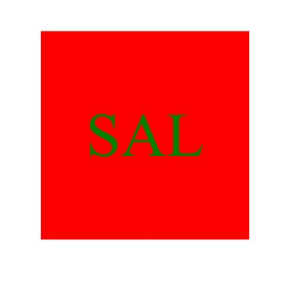

# My Logo Generator 3000

## Description

- This project was created to gain practical application experience in the use of Inquirer and Jest packages. With the use of these packages, I was able to create an app that
  takes the users input an makes a logo for them. The prompt consist of four questions, that ask the user for text, text color, shape and shape color for the logo. With this
  information, we are able to return a custome logo for the user to put anywhere they want.

## Installation

- The installation is fairly straight forward. You can just go to my repo link from the lines below and clone yourself a copy of this application. The GitHub url is provided
  in the credits section.

## Usage

- To use this application all you need to do is scope a terminal, and enter the 'node index.js' to start the application. You will be promted with four questions, that will ask
  you about the color, shape type, and text that you want inside the logo. After the questions are done, you will have created or overided the logo.svg file if there was already
  one in the examples folder. All you have to do next is open up the logo.svg file in a live server and you can see a preview of your logo.

- Here is few images that show you how to use the application:

  ;

  ;

  ;

## Credits

- GitHub url: https://github.com/Sal1316/my-log-generator-3000

- Video walkthrough link: https://drive.google.com/file/d/1QsWtTorpbrkQM3p23HYHyMZhwSeQzs35/view

## Features

- This project does not have to many features, but some are that is uses, 'Inquirer' and 'Jest'.

## Tests

- This project uses Jest to test that the output is what we want. In the shapes.test.js file, you will find three tests that make sure each shape(circle, squre, and triangle)
  have the correct outputs to render on the screen when done.
